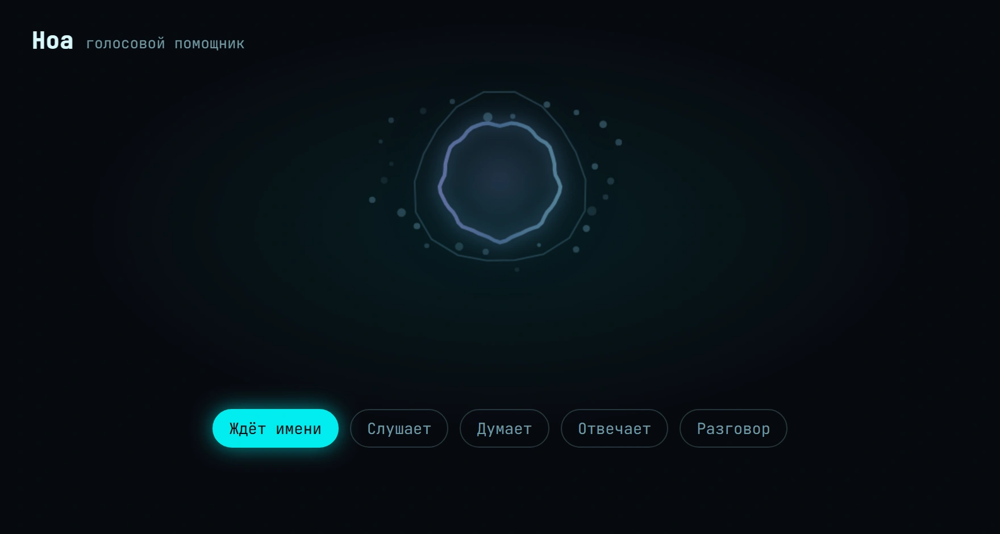
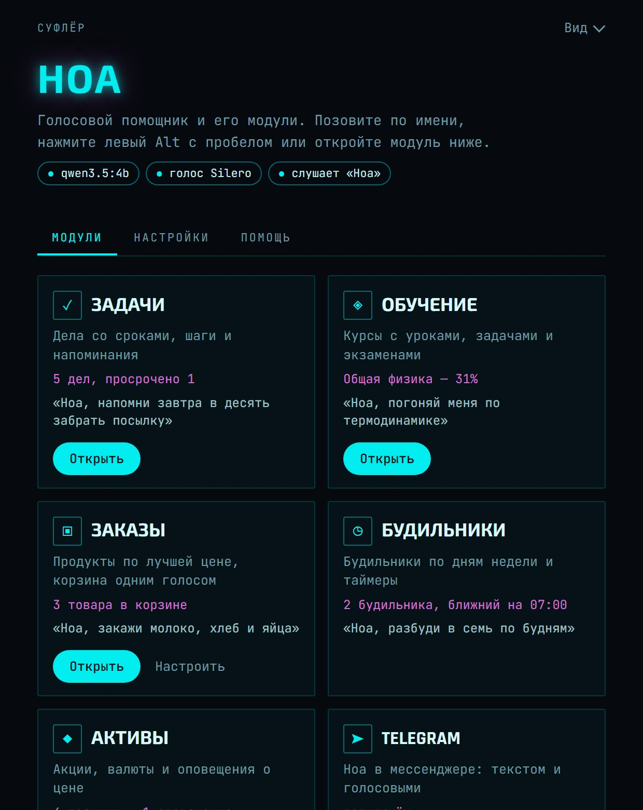
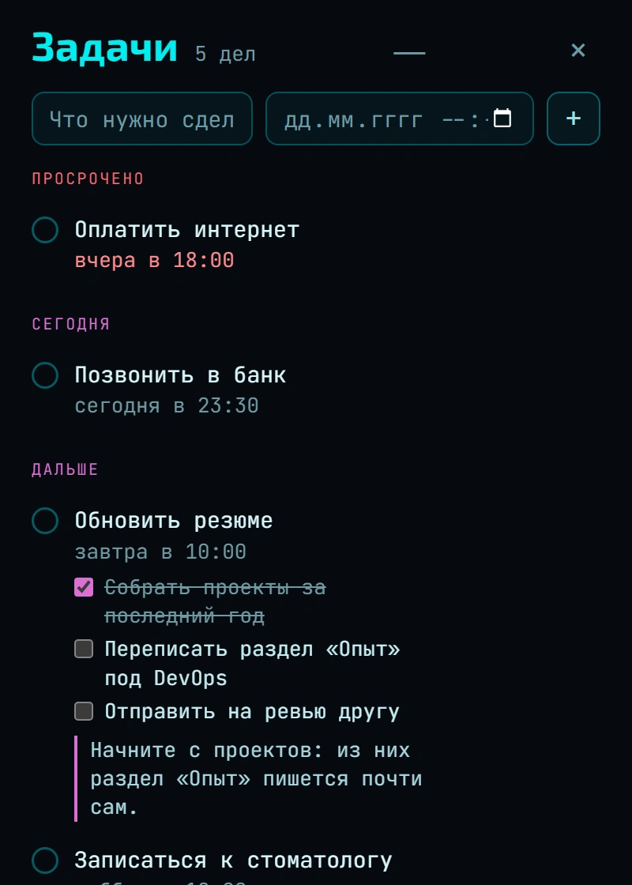
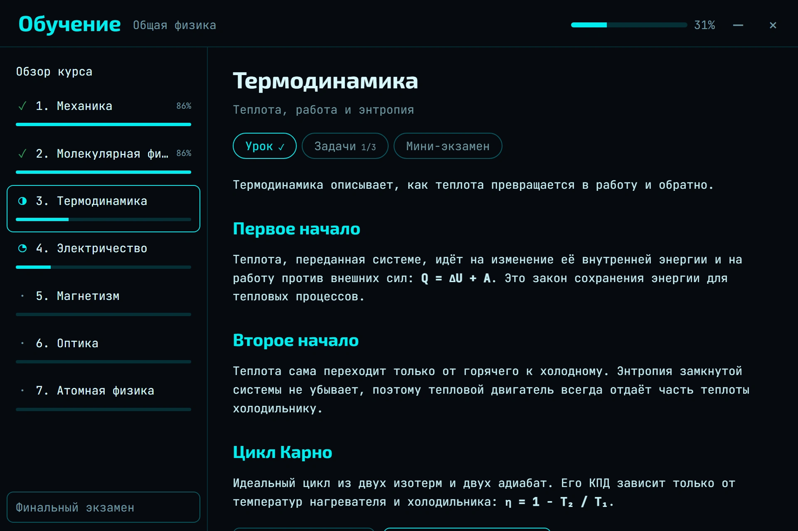
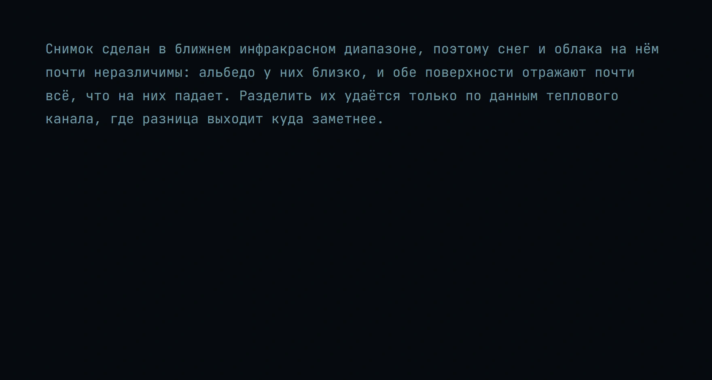

<div align="center">

# Суфлёр

**Ноа — мультимодальная оболочка для ИИ.**
Подключите любую нейросеть и соберите модуль под свою задачу за пару минут —
без программирования.



[**Скачать**](../../releases) · [Как это работает](#как-это-работает) · [Что уже есть](#что-уже-есть) · [Установка](#установка)

</div>

---

## Как это работает

1. **Подключите модель.** Свою через Ollama — бесплатно и без интернета — или
   облачную по ключу: OpenRouter, Google AI Studio, Groq, любой
   OpenAI-совместимый сервис.
2. **Скажите своей нейросети, что нужно.** Подключите к ней Ноа по MCP и
   попросите: «сделай модуль, который рассказывает погоду».
3. **Пользуйтесь.** Нейросеть пишет модуль, Ноа запускает его через несколько
   секунд и понимает голосом: «Ноа, какая погода в Казани?»

Подключение Ноа к Claude Code:

```bash
claude mcp add noa -- "C:\путь\к\sufler.exe" --mcp
```

В Claude Desktop, Cursor и других клиентах — так же: команда `sufler.exe`,
аргумент `--mcp`.

Готовые модули ставятся из библиотеки в главном окне. Своим модулем можно
поделиться — формат описан в [modules/README.md](modules/README.md).

## Что уже есть

Всё ниже — примеры того, что собирается на Ноа.

### Голос

Ноа живёт в трее и отзывается на имя. Дальше идёт разговор без клавиш:
**ждёт имени** → **слушает** → **думает** → **отвечает**, пока вы не
попрощаетесь. Имя можно сменить в настройках.

Речь распознаётся и синтезируется на этом компьютере: Whisper, голоса Silero
или Piper.

| Клавиши | Что происходит |
|---|---|
| **Левый Alt + Пробел** | спросить голосом, удерживая клавиши |
| **Esc** | остановить речь, слушание и ответ |
| **Ctrl + Shift + Alt + Пробел** | включить или выключить ожидание имени |
| **Ctrl + Alt + Пробел** | отвечать с окном или только голосом |

### Модули

<p align="center">

</p>

| Модуль | Что делает | Пример |
|---|---|---|
| **Задачи** | дела со сроками, шаги и совет, с чего начать | «напомни завтра в десять забрать посылку» |
| **Обучение** | курсы с уроками, задачами и экзаменами | «погоняй меня по термодинамике» |
| **Заказы** | продукты по лучшей цене, корзина одной фразой | «закажи молоко, хлеб и яйца» |
| **Будильники** | будильники по дням недели и таймеры | «разбуди в семь по будням» |
| **Активы** | котировки и оповещения о цене | «какой курс евро» |
| **Компьютер** | программы, сайты, скриншоты, питание | «открой телеграм» |
| **Telegram** | помощник в мессенджере | ответит текстом или голосом |

<p align="center">

&nbsp;

</p>

### Объяснения по выделению

<p align="center">

</p>

Выделите термин с зажатым **левым Ctrl** — рядом появится короткое объяснение,
в любой программе.

## Установка

Скачайте `.exe` из [**Releases**](../../releases) и запустите. Windows 10 / 11.

На «Windows защитила ваш компьютер» нажмите «Подробнее» → «Выполнить в любом
случае»: у программы нет платной подписи. Контрольная сумма — в описании
релиза.

Суфлёр прописывается в автозапуск и живёт в трее. Своя модель скачивается при
первом запуске и подбирается по видеопамяти. Модели, голос, имя помощника,
прокси и виджет расхода настраиваются в главном окне.

## Сборка

```bash
npm install
npm run tauri dev      # запуск
npm run tauri build    # установщик
```

Нужны [Rust](https://rustup.rs) и Node 20+.
