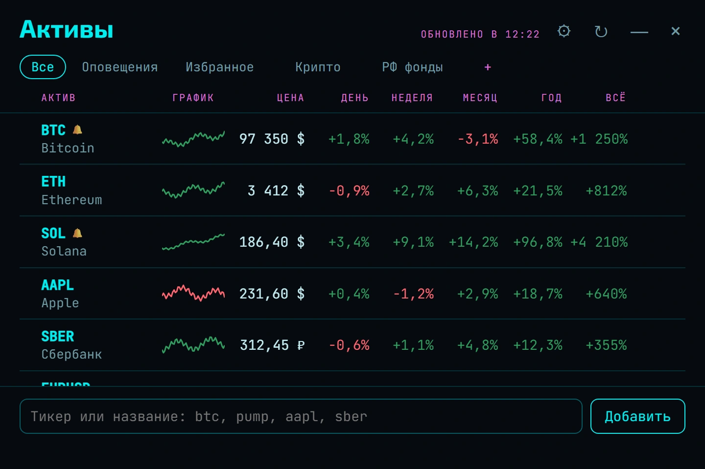

<div align="center">

# Суфлёр

**Голосовой помощник Ноа и его модули — поверх любой программы.**
Позовите по имени — поставит задачу, покажет курс биткоина, погоняет по докеру,
закажет продукты. Выделите непонятное слово — объяснит рядом с ним.


[**Скачать**](../../releases) · [**Посмотреть вживую**](http://84.247.166.53:5173/demo.html) · [Модули](#модули) · [Голос](#голос) · [Настройки](#настройки)

</div>

---

## Что это

Небольшая программа, которая живёт в трее. Внутри — помощник **Ноа**: он
слушает, понимает сказанное своими словами и отвечает голосом. Всё, что он
умеет делать, разложено по **модулям**: у каждого модуля своё окно, свои
команды голосом и в Telegram.

- **Голос без облака.** Речь распознаётся и синтезируется на этом же
  компьютере: Whisper и голоса Silero или Piper.
- **Мозг — на выбор.** Своя модель через Ollama — без ключей и интернета — или
  облачная по ключу: OpenRouter, Google AI Studio, Groq, любой сервис с
  OpenAI-совместимым API.
- **Модули.** Задачи, активы, обучение, заказ продуктов, будильники, Telegram —
  и управление самим компьютером.
- **Объяснения по выделению.** Выделите термин с зажатым **левым Ctrl** — рядом
  появится короткое объяснение, в любой программе.
- **Не мешает.** Обычное выделение ничего не открывает, фокус не забирается.
- **Четыре темы** — тёплые светлая и тёмная, неоновая и synthwave.

## Как пользоваться

| Действие | Что происходит |
|---|---|
| Сказать **«Ноа»** | помощник начинает слушать |
| **Левый Alt + Пробел** | спросить голосом, удерживая клавиши |
| **Esc** | остановить речь, слушание и ответ; закрыть окно |
| **Ctrl + Shift + Alt + Пробел** | включить или выключить ожидание имени |
| **Ctrl + Alt + Пробел** | показывать окно с ответами или отвечать только голосом |
| Выделить текст с зажатым **левым Ctrl** | объяснение рядом с выделением |
| **Пробел** в открытом окне | прочитать вслух |
| Щелчок по значку в трее | развернуть свёрнутые окна; если свёрнутых нет — главное окно |

Главное окно открывается из трея и ярлыком. Вкладка **Модули** — плитки со
состоянием каждого модуля и кнопкой «Открыть», **Настройки** — модель, голос,
микрофон и остальное, **Помощь** — проверка перехвата, прокси и журнал.

## Модули

### Задачи


«Ноа, напомни завтра в десять позвонить в банк» — дело появится в списке со
сроком. Формулировки любые: «добавь на сегодня доделать резюме», «отметь резюме
сделанным», «перенеси банк на завтра», «какие у меня дела».

- Группы: **Просрочено**, **Сегодня**, **Дальше**, **Когда-нибудь**.
- «Помоги с резюме» — дело раскладывается на шаги с советом, с чего начать.
- «Удали эту задачу», «удали задачу про банк», «удали задачу на 18:00» —
  удаляется названное; непонятно какое — Ноа переспросит.
- «Убери сделанные», «перенеси сделанные в архив» — убираются все сделанные
  разом; «что в разделе "Сделано"» — перечисляет их. Все дела подряд голосом
  не удаляются.
- «Напомни через час», «через полчаса» — срок считается от часов компьютера.
- Вечером Ноа может пройти по несделанному и предложить перенести.
- Дела со сроком можно отправлять в Google Календарь по своему ключу.

Список хранится на диске рядом с настройками.

<br clear="right">

### Активы



«Покажи мои активы», «добавь биткоин в избранное», «поставь алерт на биткоин на
100 тысяч».

- Цена и изменение за день, неделю, месяц, год и всё время, маленький график.
  Щелчок по периоду упорядочивает список, по тикеру — открывает TradingView.
- Монеты — по CoinGecko, акции, фонды и валютные пары — по Yahoo, российские
  акции — по Мосбирже.
- Вкладки со своими названиями; строки перетаскиваются за ручку слева.
- «⋯» у строки — вкладки актива и оповещения о цене. Сработавшее оповещение
  приходит в Telegram, без Telegram — окном. Вкладка **Оповещения** — сколько
  осталось до цены.
- ⚙ скрывает лишние колонки.

### Обучение


Трей → «Обучение» или «Ноа, открой обучение». Встроенный курс **DevOps** к
собеседованию — 12 тем: Linux, сети, Git, Bash, Docker, Kubernetes, CI/CD,
Terraform и Ansible, облака, мониторинг, безопасность, SRE.

- В теме — урок, практические задачи и мини-экзамен (сдан от 70%), в конце
  курса — финальный экзамен (от 75%).
- Вопросы с вариантами проверяются сразу, открытые ответы модель сверяет с
  ключевыми пунктами эталона. Ошибки копятся для повторения.
- «🎙 Надиктовать» — ответ голосом; «🎙 Сдать устно» — Ноа задаёт вопросы
  экзамена вслух и слушает ответы.
- «💬 Обсудить тему» — разговор голосом, в котором модель знает урок.
  «💬 Обсудить этот вопрос» под разбором ответа — Ноа знает вопрос, ваш ответ,
  эталон и ключевые пункты.
- Голосом и в Telegram: «погоняй меня по докеру» — вопрос, ответ, разбор,
  следующий; «хватит» — итог. «Как мой прогресс по девопсу».

Свои курсы добавляются через MCP (см. ниже): «составь мне курс по китайскому
для Ноа» в Claude — и курс появится в окне.

### Заказы

«Ноа, закажи яйца, хлеб и молоко» — продукты подбираются по настоящим ценам, и
всегда в одном магазине. Цены сравниваются во **ВкусВилле**, **Магните**,
**Метро** и **Пятёрочке** (последняя — по ключу parse.bot). Назовёте магазин —
подбор пойдёт там; не назовёте — там, где полнее и дешевле.

- Корзину Ноа собирает во ВкусВилле: она складывается целиком и открывается
  готовой ссылкой. В остальных магазинах подобранное показывается в окне заказа.
- Товар выбирается по названию и цене за литр или килограмм, в названном
  количестве; оптовые упаковки в домашнюю корзину не попадают.
- Уточнения — в разговоре: «а семечки возьми полосатые», «собери во ВкусВилле».
- Оплата без подтверждения — только в пределах, по умолчанию до 3000 ₽ за заказ
  и 5000 ₽ за сутки; дороже — кнопкой в окне заказа.
- Номер карты и пароли Суфлёр не хранит: вход и карта остаются в аккаунте
  магазина. Поиск и корзина идут через сервис FoodPilot.

### Будильники и таймеры

- «Поставь таймер на 10 минут», «отмени таймер», «сколько осталось».
- «Разбуди в семь по будням» — разово, каждый день, по будням, по выходным, по
  дням недели. «Какие у меня будильники», «удали будильник на 7:30».
- Будильник звенит, пока не скажете «стоп» или «отложи на 10 минут»; Esc тоже
  выключает.
- «Который час», «какое сегодня число» — по часам компьютера.

### Telegram

Свой бот (заводится у @BotFather, токен — в настройках): с Ноа можно говорить
и там, пока программа запущена. На текст он отвечает текстом, на голосовое —
голосом. Работает всё то же, что голосом за компьютером; бот отвечает только
вашему чату. Туда же приходят оповещения о ценах и сработавшие таймеры;
«пришли скриншот» — придёт снимок экрана.

### MCP

`sufler.exe --mcp` — Ноа как MCP-сервер для Claude Desktop, Claude Code и
других клиентов. Инструменты: формат курса, создать курс, добавить тему,
удалить курс, список курсов с прогрессом, передать Ноа фразу как сказанную
голосом.

- Claude Code: `claude mcp add noa -- "C:\путь\к\sufler.exe" --mcp`
- Claude Desktop: в `mcpServers` файла `claude_desktop_config.json` —
  `"noa": { "command": "C:\\путь\\к\\sufler.exe", "args": ["--mcp"] }`

### Свои модули

Модуль — MCP-сервер с описанием `module.json`. Ноа запускает его, берёт список
инструментов и вызывает их по смыслу фразы, а ответ пересказывает голосом:
«Ноа, запомни, что Маша любит тюльпаны» → модуль «Память» сохраняет факт,
«что ты помнишь про Машу» → находит его.

- **Библиотека** — главное окно → «Свой модуль» → «Библиотека»: память, файлы,
  чтение страниц, браузер, документация библиотек, пошаговое мышление.
  Модулям из npm нужен [Node.js](https://nodejs.org).
- **Свой сервер** — «Подключить MCP»: название, команда запуска, что умеет,
  пример фразы.
- **Поделиться** — формат описания и порядок добавления в библиотеку — в
  [modules/README.md](modules/README.md).

## Компьютер

Ноа управляет компьютером теми же словами, что вы сказали бы человеку рядом.

- **Программы и окна.** «Открой телеграм», «закрой хром», «запусти киберпанк»,
  «запусти мортал шелл в песочнице», «открой параметры блютуз». Программы
  ищутся в меню «Пуск», в Steam и в папках с играми. «Закрой» не оставляет
  программу в фоне; «сними задачу хром» — сразу и целиком.
- **Сайты.** «Открой вайлдберриз», а следом «давай посмотрим чехлы для айфона» —
  выдача самого сайта в вашем браузере. «Пролистай вниз», «назад», «закрой
  вкладку».
- **Вопросы к интернету.** «Сколько стоит биткоин», «курс доллара» — CoinGecko и
  ЦБ. Остальное Ноа ищет в Google в невидимом окне браузера и отвечает по
  выдаче; не нашлось — новости, Википедия, Яндекс Карты.
- **Музыка.** «Включи музыку», «включи радио» — своя станция из настроек,
  по умолчанию трансляция Claude Radio на YouTube.
- **Скриншоты.** «Сделай скриншот» — весь экран в «Изображения\Суфлёр»; «скрин
  хрома» — окно программы.
- **VPN.** «Включи впн», «выключи впн».
- **Питание.** «Усыпи компьютер», «заблокируй экран» — сразу; «выключи
  компьютер», «перезагрузи» — через минуту, «отмени выключение» отменяет.
- **Состояние.** «Что грузит компьютер», «сколько места на диске», «сколько
  занято видеопамяти» — цифры берутся у Windows.
- **Ошибки.** «Ноа, что это за ошибка?» — Ноа читает окно впереди и журнал
  Windows за полчаса и говорит, что случилось и что сделать.
- **Файлы.** «Найди на компьютере фото паспорта», «где мой договор».
- **Правда или фейк.** Скопировали новость или сделали скриншот — «Ноа, это
  правда?». Ответ коротко: «Правда», «Фейк» или «Не подтверждается» и один факт.
- **Печать и сообщения.** «Напечатай: буду через десять минут». «Напиши Маше в
  телеграм, что я опоздаю» — Ноа запомнит текст и отправит только после «да».
- **Claude.** «Спроси Клода, как написать резюме» — вопрос уходит в Claude.

## Объяснения по выделению

<div align="center">


</div>

Выделите термин с зажатым **левым Ctrl** — рядом всплывёт короткое
объяснение. Мало — нажмите **?**, и Ноа разберёт по шагам, что происходит и
почему. Доспросить можно в поле «Спросить ещё…» или выделив кусок ответа с Ctrl.

Окно двигается за любое место и растягивается за края; закрывается по **Esc**,
забытое уходит само через минуту бездействия. На вопрос, заданный голосом, окно
открывается посреди экрана.

На телефоне — обычное выделение и пункт **«Объяснить»** в меню рядом с
«Копировать».


## Голос

<div align="center">


</div>

Скажите **«Ноа»** — и помощник начнёт слушать; можно сразу с вопросом. Имя
узнаётся на слух: «Ноя», «Ной», «Нова» тоже подходят, а похожие слова считаются
обращением только с паузой за ними.

После первого ответа начинается разговор: клавиши не нужны, Ноа слушает,
отвечает и снова слушает, пока вы не попрощаетесь — «спасибо», «до связи»,
«хватит». Ответы короткие и разговорные. Нить разговора помнится десять минут
после последней реплики: следующий вызов может продолжить ту же тему. На
«привет» и «ты тут?» Ноа отвечает одним словом, не спрашивая модель.

**Esc** останавливает всё, что голос делает в эту секунду: речь, слушание,
ответ, который ещё думается. Пока Ноа говорит, микрофон не слушает; перебить
можно левым Alt с пробелом. Если во время разговора начать печатать, разговор
заканчивается.

**Чем говорит.** В настройках:

- **Silero** — живые голоса Ксения, Байя, Айдар, Евгений. Скачиваются по
  кнопке (около 350 МБ: свой Python, PyTorch для процессора и модель). Голосовой
  сервер поднимается, пока вы говорите, и уходит сам через десять минут тишины.
- **Piper** — около 80 МБ, звучит проще.

При сбое Silero ответ звучит голосом Piper. Распознавание — Whisper, 1,5 ГБ
(2,1 ГБ со сборкой под NVIDIA). Если свободной видеопамяти мало, распознавание
работает на процессоре. Скорость речи — ползунком.

**Bluetooth-наушники.** Пока открыт микрофон гарнитуры, Windows переключает
наушники в режим разговора: звук становится моно и тише. Поэтому с микрофоном
наушников ожидание имени не включается — зовите Alt+пробелом или выберите
отдельный микрофон в настройках.

Пока открыто окно объяснения, пробел принадлежит ему. Левый Alt с пробелом
занят всё время, пока программа запущена: системное меню окна этим сочетанием
открываться перестанет.

## Установка

Зайдите в [**Releases**](../../releases), скачайте `.exe` и запустите.
Программа выпускается под **Windows 10 / 11**; код для macOS, Linux и Android в
репозитории есть, но их сборки пока не проверены.

Появится окно «Windows защитила ваш компьютер» → «Подробнее» → «Выполнить в
любом случае»: так система встречает программу без платной подписи. Если
Defender удалил файл — сверьте SHA-256 с описанием релиза.

Дальше программа прописывается в автозапуск и поднимается сама, молча, в трей.
Повторный запуск ярлыка не плодит копии, а разворачивает свёрнутые окна или
открывает главное.

Своя модель скачивается при первом запуске; какая — решается по видеопамяти:
от 11 ГБ — `qwen3.5:9b`, от 6 ГБ — `qwen3.5:4b`, без видеокарты — `gemma3:1b`.

**Удаление** — Параметры → Приложения → Sufler → Удалить; деинсталлятор сам
закрывает программу.

## Настройки

**Мозг Ноа.** Из коробки — своя модель через Ollama: без ключей, регистрации и
интернета. Облачный сервис выбирается в том же окне:

- **OpenRouter, Google AI Studio, Groq** — по ключу. Для облачного сервиса
  выпадающий список показывает бесплатные модели, свежие от самого сервиса;
  выбранная сразу становится рабочей. Платную модель вписывают в поле под
  списком.
- У бесплатных моделей OpenRouter лимит — десятки запросов в минуту и около
  полусотни в сутки. Пока выбрана бесплатная облачная модель, команды
  разбирает своя модель, и облако получает один запрос на фразу вместо двух.
  С платной моделью облако делает всё, видеокарта свободна.
- Облачные модели просят думать минимально, а неизменная часть запроса идёт
  первой — сервисы кешируют её, повторные запросы дешевле.
- «Проверить» делает пробный запрос; модель, которой у сервиса больше нет,
  заменяется живой, а отказ по настройкам аккаунта объясняется словами.

**Виджет расхода.** Строка на рабочем столе: `124k / 3.3m  $0.59` — токены
сегодня и за месяц и деньги за месяц. При наведении — траты за сегодня, остаток
на счёте OpenRouter и модель. Токены считаются по каждому ответу модели,
стоимость присылает OpenRouter. Перетаскивается, место запоминается; двойной
щелчок — поверх окон. Включается галочкой в настройках.

То же задаётся файлом `config.json`:

```json
{
  "ai": {
    "provider": "http",
    "endpoint": "https://адрес-вашего-api",
    "apiKey": "ключ",
    "model": "название-модели",
    "proxy": ""
  },
  "ui": { "theme": "neon" }
}
```

`theme` — `system`, `dark`, `light`, `neon` или `synthwave`. Остальные параметры
описаны в `config.example.json`.

**Если сервис не отвечает** из-за региональных ограничений — впишите прокси
(`http://хост:порт` или `socks5://хост:порт`) в поле «Прокси» на вкладке
«Помощь».


## Что стоит знать

**Память.** Своя модель держится в видеопамяти двадцать минут после последнего
вопроса и выгружается при выходе. Голосовой сервер Silero уходит через десять
минут тишины.

**Вопрос без микрофона.** `sufler.exe --ask "сколько стоит биткоин"` —
работающий Суфлёр примет фразу как сказанную голосом.

**Буфер обмена.** Chrome, Edge, Telegram, VS Code не отдают выделенный текст
системе — для них Суфлёр нажимает Ctrl+C сам и возвращает прежнее содержимое
буфера. Выключается галочкой на вкладке «Помощь».

## Сборка из исходников

```bash
npm install
npm run tauri dev      # запуск
npm run tauri build    # установщик для текущей системы
```

Нужен [Rust](https://rustup.rs) и Node 20+. На Linux дополнительно:

```bash
sudo apt install libwebkit2gtk-4.1-dev libgtk-3-dev \
  libayatana-appindicator3-dev librsvg2-dev libssl-dev
```

Картинки для README снимаются с настоящих окон на тестовых данных:
`python scripts/shots/make.py` (нужны Chrome или Edge и Pillow).
