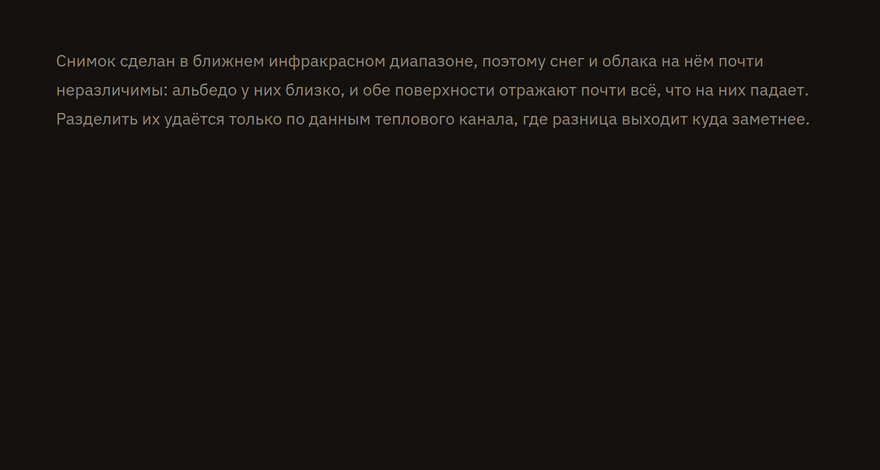

<div align="center">

# Суфлёр

**Выделите непонятное слово — и рядом появится объяснение.**
Или просто позовите по имени. В любой программе, а не только в браузере.



[**Скачать**](../../releases) · [**Посмотреть вживую**](http://84.247.166.53:5173/demo.html) · [Как пользоваться](#как-пользоваться) · [Настройки](#настройки)

</div>

---

## Что это

Небольшая программа, которая живёт в трее и ждёт. Встретили в статье, письме или коде
незнакомый термин — выделили его с зажатым **левым Ctrl**, и рядом с текстом всплыло
короткое объяснение. Не нужно переключаться в браузер, открывать вкладку и терять место,
на котором читали.

- **Работает поверх любого приложения** — браузер, почта, PDF, редактор кода, мессенджер.
- **Отзывается на имя.** Скажите «Ноа» — и можно спрашивать голосом, не трогая клавиатуру.
- **Объясняет по сути.** Сначала одно предложение. Мало — нажмите «?», и появятся
  «простыми словами» и примеры.
- **Можно доспросить.** Прямо в окне: «а почему так?» — с учётом исходного термина.
- **Не мешает.** Обычное выделение текста ничего не открывает. Только с левым Ctrl.
- **Не забирает фокус.** Курсор остаётся там, где был, выделение не сбрасывается.
- **Светлая и тёмная тема** — по настройке системы.

## Как пользоваться

| Действие | Что происходит |
|---|---|
| Выделить текст с зажатым **левым Ctrl** | открывается объяснение |
| Нажать **?** | «простыми словами» и примеры |
| Написать в поле «Спросить ещё…» | уточняющий вопрос по этому же термину |
| **Esc** | закрыть |
| Сказать **«Ноа»** | помощник начинает слушать |
| **Пробел** в открытом окне | прочитать вслух |
| **Левый Alt + Пробел** | спросить голосом, удерживая клавиши |
| **Ctrl + Shift + Alt + Пробел** | включить или выключить ожидание имени |

На телефоне иначе: выделите текст обычным способом и выберите **«Объяснить»** в меню
рядом с «Копировать».


## Установка

Зайдите в [**Releases**](../../releases), скачайте `.exe` и запустите.

Пока программа выпускается только под **Windows 10 / 11**. Код для macOS, Linux
и Android в репозитории есть, но их сборки либо ни разу не собрались, либо ни разу
не были проверены в работе, — а обещать файл, которого нет, хуже, чем честно его
не предлагать. Как заработают, появятся в releases.

### Первый запуск

Появится синее окно «Windows защитила ваш компьютер» → «Подробнее» →
«Выполнить в любом случае». Так система встречает любую программу без платной
подписи разработчика.

Если Defender молча удалил файл — это ложное срабатывание на неподписанный
установщик. Сверьте SHA-256 скачанного файла со значением в описании релиза
или сообщите о нём через
[Microsoft Security Intelligence](https://www.microsoft.com/en-us/wdsi/filesubmission).

При запуске открывается окно настройки — в нём живая проверка перехвата: выделите любое
слово с левым Ctrl, и строка покажет, дошёл ли жест и удалось ли получить текст. Окно
можно закрыть сразу, программа продолжит работать в трее. Повторный запуск ярлыка не
плодит копии, а снова показывает это же окно.

Дальше вмешиваться не нужно. Программа прописывается в автозапуск и при следующем
входе в систему поднимается сама — молча, без окна, сразу в трей. Там же она запускает
Ollama, если та не отвечает, и заранее загружает модель в память, чтобы первое
выделение не ждало загрузки. Автозапуск отключается галочкой «Запускать вместе
с системой» в том же окне.

В первый раз модель ещё нужно скачать — несколько гигабайт, и до конца загрузки
объяснения приходить не будут. Какая именно, программа решает сама по видеопамяти:
на карте от 8 ГБ — `qwen2.5:7b`, от 6 ГБ — `gemma3:4b`, без видеокарты — маленькая
`gemma3:1b`, потому что считать будет процессор.

### Удаление

Обычным способом: Параметры → Приложения → Sufler → Удалить. Программа живёт в трее и
сама себя закрывать не обязана, поэтому деинсталлятор снимает её перед удалением файлов.
Если удаление всё же встало — снимите `sufler.exe` в Диспетчере задач и повторите.

## Голос

<div align="center">


</div>

Скажите **«Ноа»** — и помощник начнёт слушать. Можно сразу с вопросом: «Ноа, что
такое альбедо». Ни клавиш, ни окна для этого не нужно — он ждёт имени всё время,
пока запущен.

Имя узнаётся на слух, а не по написанию: расшифровка пишет его то «Ноя», то
«Ной», то «Нова», и одна буква расхождения помощника не смущает. Слова, похожие
на имя, считаются обращением только когда за ними пауза, — «ночь была тихая»
разговор не начинает.

**Ctrl + Shift + Alt + Пробел** включает и выключает это ожидание, не открывая
настройки. Выключенным оно не занимает ни микрофон, ни видеопамять: распознавание
останавливается целиком, а это под полтора гигабайта. Галочка «Отзываться на имя»
в окне настройки делает то же самое.

Пробел в открытом окне — прочитать объяснение вслух. Читается то, что появилось
последним: открыли — определение, нажали «?» — «простыми словами» и примеры,
спросили — ответ.

Левый Alt с пробелом — задать вопрос голосом: держите клавиши и говорите,
отпустите — вопрос уйдёт в тред, а ответ прозвучит вслух. Это работает и при
закрытом окне: спросите с чистого места, и окно откроется само уже с ответом.

После первого ответа начинается разговор: клавиши больше не нужны, просто
говорите. Программа слушает, отвечает вслух и снова слушает — пока вы с ней не
попрощаетесь: «спасибо», «до связи», «ну всё, пока», «давай прощаться». На этом
разговор заканчивается, и окно закрывается вместе с ним: оно было расшифровкой
сказанного, а не рабочим местом. Закрыть окно (Esc) — тоже заканчивает разговор.

Пока программа говорит, микрофон не слушает: иначе она записала бы собственный
голос из колонок и ответила бы сама себе. Если перебить её левым Alt с пробелом,
она замолчит и начнёт слушать.

Голос и распознавание работают на этом же компьютере и скачиваются из окна
настройки: синтезатор с голосом — около 80 МБ, распознавание — 1,5 ГБ
(2,1 ГБ со сборкой под видеокарту NVIDIA, зато расшифровка почти мгновенная).
Скорость речи настраивается ползунком.

Щелчок мимо окна его не закрывает. Окно всплывает поверх той программы, в которой
вы читаете, и щёлкать в ней вы продолжаете — поставить курсор, прокрутить, выделить
дальше; закрытие по первому же щелчку означало бы, что окно исчезает от любого
движения рядом. Закрывает **Esc** — и новое выделение с левым Ctrl, которое просто
показывает в том же окне следующее слово. Забытое окно уходит само через минуту:
минута считается от последнего события, поэтому пока вы читаете, водите мышью или
слушаете ответ, оно никуда не денется.

Пока окно открыто, пробел принадлежит ему и в другие программы не попадает —
иначе он печатался бы в том тексте, который вы читаете. Закройте окно клавишей
Esc, и пробел снова обычный. Внутри самого окна — например в поле «Спросить
ещё…» — пробел работает как обычно.

Сочетание левый Alt с пробелом занято всё время, пока программа запущена, а не
только при открытом окне: иначе им нельзя было бы задать вопрос с чистого места.
В Windows это сочетание открывает системное меню окна — с Суфлёром оно
открываться перестанет.

## Настройки

Из коробки объяснения даёт своя модель на этом же компьютере: без ключей, без
регистрации и без интернета, и ничего никуда не отправляется. Она же умеет
«простыми словами», примеры и уточняющие вопросы.

Если своя модель не подходит — компьютер слабый, места на диске нет, — в окне
настройки выбирается другой источник: Википедия (без ключа, только определения) или
облачный сервис по ключу. То же самое можно задать файлом `config.json` рядом
с программой:

```json
{
  "ai": {
    "provider": "http",
    "endpoint": "https://адрес-вашего-api",
    "apiKey": "ключ",
    "model": "название-модели",
    "proxy": ""
  },
  "ui": {
    "theme": "system"
  }
}
```

`theme` — `system`, `dark` или `light`. Остальные параметры (таймауты, повторы запросов)
описаны в `config.example.json`.

**Если сервис не отвечает.** Часть сервисов моделей недоступна из некоторых стран: ключ
есть, интернет есть, а запрос не доходит. Впишите адрес прокси в поле «Прокси» в окне
настройки или в `proxy` в файле — понимаются `http://хост:порт` и `socks5://хост:порт`.
VPN-клиенты обычно поднимают socks5 на `127.0.0.1`, порт смотрите в их настройках.
Википедия работает без этого.


## Что стоит знать

**Буфер обмена на Windows.** Программы на Chromium — Chrome, Edge, Telegram, Discord,
VS Code — не показывают системе выделенный текст. Для них Суфлёр нажимает Ctrl+C за вас
и сразу возвращает в буфер обмена то, что там было. Способ включён по умолчанию и
выключается галочкой в окне настройки.

## Сборка из исходников

```bash
npm install
npm run tauri dev      # запуск
npm run tauri build    # установщик для текущей системы
```

Нужен [Rust](https://rustup.rs) и Node 20+. На Linux дополнительно:

```bash
sudo apt install libwebkit2gtk-4.1-dev libgtk-3-dev \
  libayatana-appindicator3-dev librsvg2-dev libssl-dev
```

### Картинки для этого файла

Гифки выше собираются из настоящего интерфейса — та же разметка, те же стили и
шрифты, что в программе, — а не записываются с экрана. Кадр задаётся номером в
ссылке, страница собирает соответствующее ему состояние, headless-браузер его
снимает. Поэтому после правки вёрстки картинки пересобираются одной командой,
а не новой записью:

```bash
python scripts/shots/make.py
```

Нужны Chrome (или Edge) и ffmpeg в PATH.


