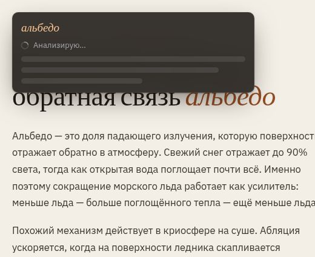
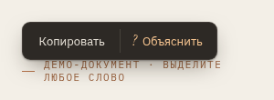
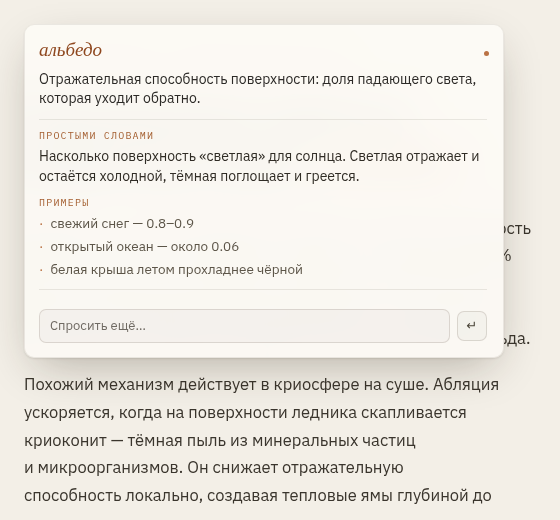

<div align="center">

# Суфлёр

**Выделите непонятное слово — и рядом появится объяснение.**
В любой программе, а не только в браузере.



[**Скачать**](../../releases) · [**Посмотреть вживую**](http://84.247.166.53:5173/demo.html) · [Как пользоваться](#как-пользоваться) · [Настройки](#настройки)

</div>

---

## Что это

Небольшая программа, которая живёт в трее и ждёт. Встретили в статье, письме или коде
незнакомый термин — выделили его с зажатым **левым Ctrl**, и рядом с текстом всплыло
короткое объяснение. Не нужно переключаться в браузер, открывать вкладку и терять место,
на котором читали.

- **Работает поверх любого приложения** — браузер, почта, PDF, редактор кода, мессенджер.
- **Объясняет по сути.** Сначала одно предложение. Мало — нажмите «?», и появятся
  «простыми словами» и примеры.
- **Можно доспросить.** Прямо в окне: «а почему так?» — с учётом исходного термина.
- **Не мешает.** Обычное выделение текста ничего не открывает. Только с левым Ctrl.
- **Не забирает фокус.** Курсор остаётся там, где был, выделение не сбрасывается.
- **Светлая и тёмная тема** — по настройке системы.

## Как пользоваться

| Действие | Что происходит |
|---|---|
| Выделить текст с зажатым **левым Ctrl** | открывается объяснение |
| Нажать **?** | «простыми словами» и примеры |
| Написать в поле «Спросить ещё…» | уточняющий вопрос по этому же термину |
| **Esc** или клик мимо окна | закрыть |

На телефоне иначе: выделите текст обычным способом и выберите **«Объяснить»** в меню
рядом с «Копировать».



## Установка

Зайдите в [**Releases**](../../releases), скачайте `.exe` и запустите.

Пока программа выпускается только под **Windows 10 / 11**. Код для macOS, Linux
и Android в репозитории есть, но их сборки либо ни разу не собрались, либо ни разу
не были проверены в работе, — а обещать файл, которого нет, хуже, чем честно его
не предлагать. Как заработают, появятся в releases.

### Первый запуск

Появится синее окно «Windows защитила ваш компьютер» → «Подробнее» →
«Выполнить в любом случае». Так система встречает любую программу без платной
подписи разработчика.

Если вместо этого Defender молча удалил файл — это ложное срабатывание на
неподписанный установщик, а не найденный вирус. Сверьте SHA-256 скачанного
файла со значением в описании релиза (раздел «Проверка файла») и при желании
сообщите о ложном срабатывании через
[Microsoft Security Intelligence](https://www.microsoft.com/en-us/wdsi/filesubmission) —
это ускоряет снятие блокировки для всех, кто скачает файл после вас.

При запуске открывается окно настройки — в нём живая проверка перехвата: выделите любое
слово с левым Ctrl, и строка покажет, дошёл ли жест и удалось ли получить текст. Окно
можно закрыть сразу, программа продолжит работать в трее. Повторный запуск ярлыка не
плодит копии, а снова показывает это же окно.

### Удаление

Обычным способом: Параметры → Приложения → Sufler → Удалить. Программа живёт в трее и
сама себя закрывать не обязана, поэтому деинсталлятор снимает её перед удалением файлов.
Если удаление всё же встало — снимите `sufler.exe` в Диспетчере задач и повторите.

## Настройки

Из коробки определения берутся из Википедии — без ключей и регистрации. Чтобы появились
«простыми словами», примеры и уточняющие вопросы, нужна языковая модель: выберите сервис
в окне настройки и вставьте ключ. То же самое можно задать файлом `config.json` рядом
с программой:

```json
{
  "ai": {
    "provider": "http",
    "endpoint": "https://адрес-вашего-api",
    "apiKey": "ключ",
    "model": "название-модели",
    "proxy": ""
  },
  "ui": {
    "theme": "system"
  }
}
```

`theme` — `system`, `dark` или `light`. Остальные параметры (таймауты, повторы запросов)
описаны в `config.example.json`.

**Если сервис не отвечает.** Часть сервисов моделей недоступна из некоторых стран: ключ
есть, интернет есть, а запрос не доходит. Впишите адрес прокси в поле «Прокси» в окне
настройки или в `proxy` в файле — понимаются `http://хост:порт` и `socks5://хост:порт`.
VPN-клиенты обычно поднимают socks5 на `127.0.0.1`, порт смотрите в их настройках.
Википедия работает без этого.



## Что стоит знать

**Буфер обмена на Windows.** Программы на Chromium — Chrome, Edge, Telegram, Discord,
VS Code — не показывают системе выделенный текст. Для них Суфлёр нажимает Ctrl+C за вас
и сразу возвращает в буфер обмена то, что там было. Способ включён по умолчанию и
выключается галочкой в окне настройки.

## Сборка из исходников

```bash
npm install
npm run tauri dev      # запуск
npm run tauri build    # установщик для текущей системы
```

Нужен [Rust](https://rustup.rs) и Node 20+. На Linux дополнительно:

```bash
sudo apt install libwebkit2gtk-4.1-dev libgtk-3-dev \
  libayatana-appindicator3-dev librsvg2-dev libssl-dev
```


